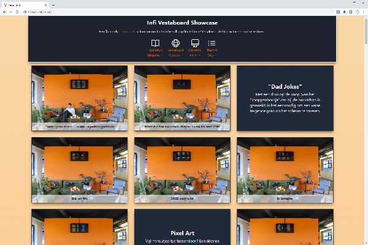
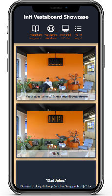

# Infi Vestaboard Showcase

Micro-app showing off what we did with our [Vestaboard](https://www.vestaboard.com/).

**🌐 View it at [https://vesta.infi.nl](https://vesta.infi.nl)**.

## Developing

After `npm install` (or `pnpm install` or `yarn`), start a development server:

```bash
npm run dev -- --open
```

## Building

To create a production version of your app:

```bash
npm run build
```

This will put build output into the `/docs` folder, which is served via GitHub Pages.

You can preview the production build with `npm run preview`.

## Expected result

You should see something like this:

  